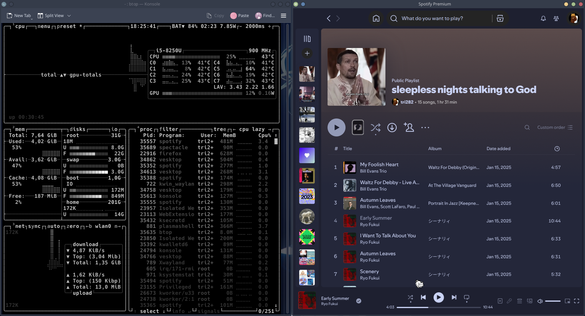
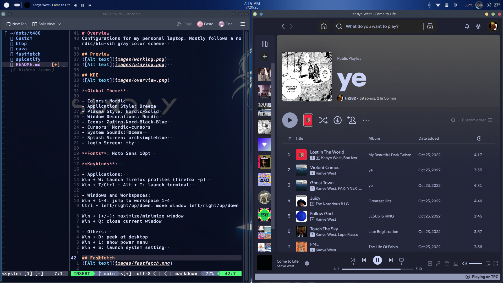
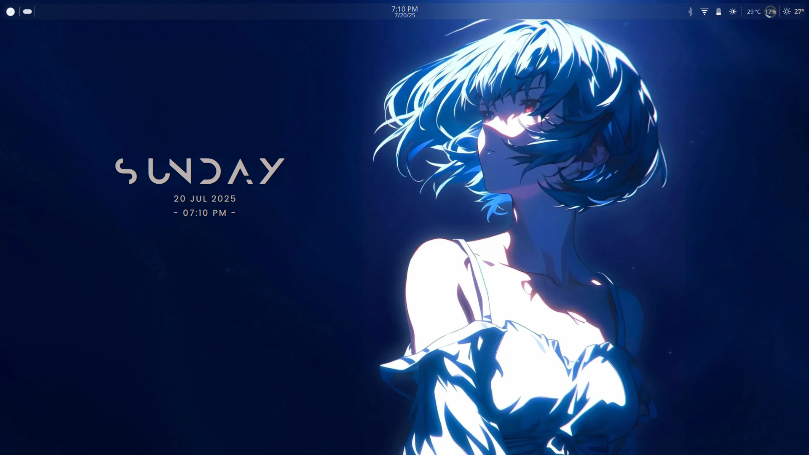
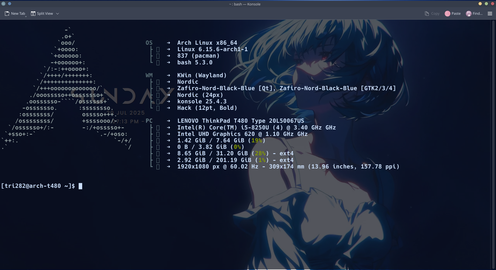
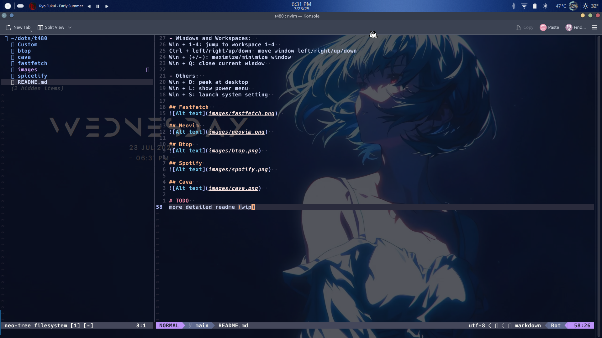
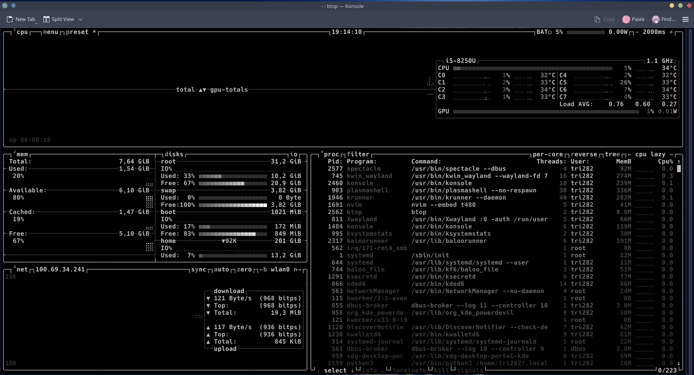
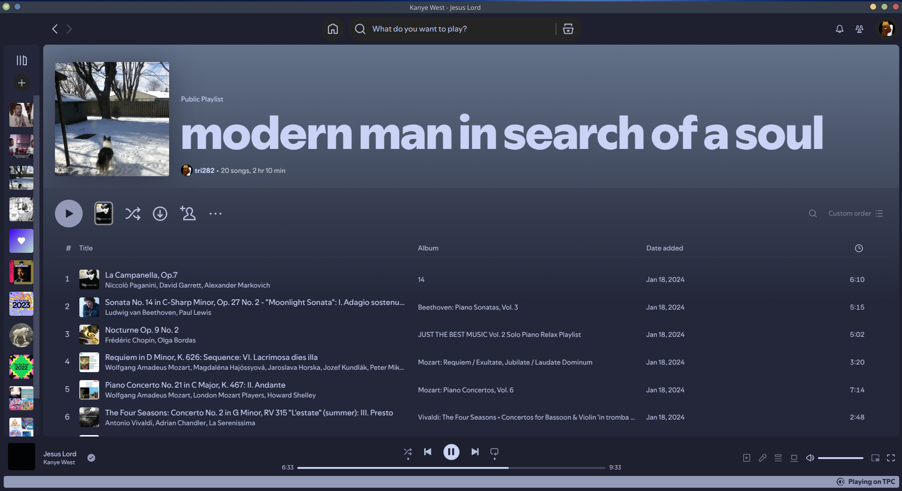
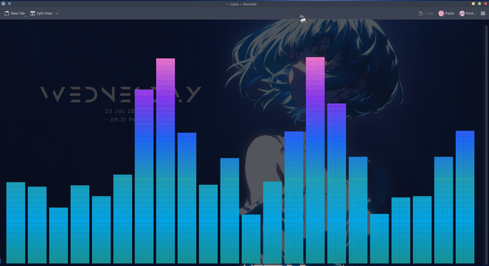

# Overview  
Configurations for my personal laptop. Mostly follows a nordic/blu-sih gray color scheme  

## Preview  
  
  

## KDE  
  

**Global Theme**  

- Colors: Nordic  
- Application Style: Breeze  
- Plasma Style: Nordic-Solid  
- Window Decorations: Nordic  
- Icons: Zafiro-Nord-Black-Blue  
- Cursors: Nordic-cursors  
- System Sounds: Ocean  
- Splash Screen: archsimpleblue  
- Login Screen: tty  

**Fonts**: Noto Sans 10pt  

**Keybinds**:  

- Applications:  
Win + W: launch firefox profiles (firefox -p)  
Win + T/Ctrl + Alt + T: launch terminal  

- Windows and Workspaces:  
Win + 1-4: jump to workspace 1-4  
Ctrl + left/right/up/down: move window left/right/up/down  
Win + (+/-): maximize/minimize window  
Win + Q: close current window  

- Others:  
Win + D: peek at desktop  
Win + L: show power menu  
Win + S: launch system setting  

**Konsole**:  
- Color scheme & Font: Solarized (modified)  
+ Foreground:  
Color: #cbdffb  
Intense color: #6b95a1  
Faint color: #effff1  
+ Background:  
Color: #0d0f1a  
Intense color: #073642  
Faint color: #002b36  
- Background color transparency: 29%  
- Font: Hack 12pt Bold, smooth fonts, draw intense colors in bold font  

## Fastfetch  
  

## Neovim  
  

- Repository: https://github.com/tri282/nvim.git  

## Btop  
  

- Theme: greyscale  

## Spotify  
  

- Spicetify theme: Dribblish - Catppuccin Mocha  

## Cava  
  

## Other Applications  
- Oneko  

# TODO  
more detailed readme (wip)  
